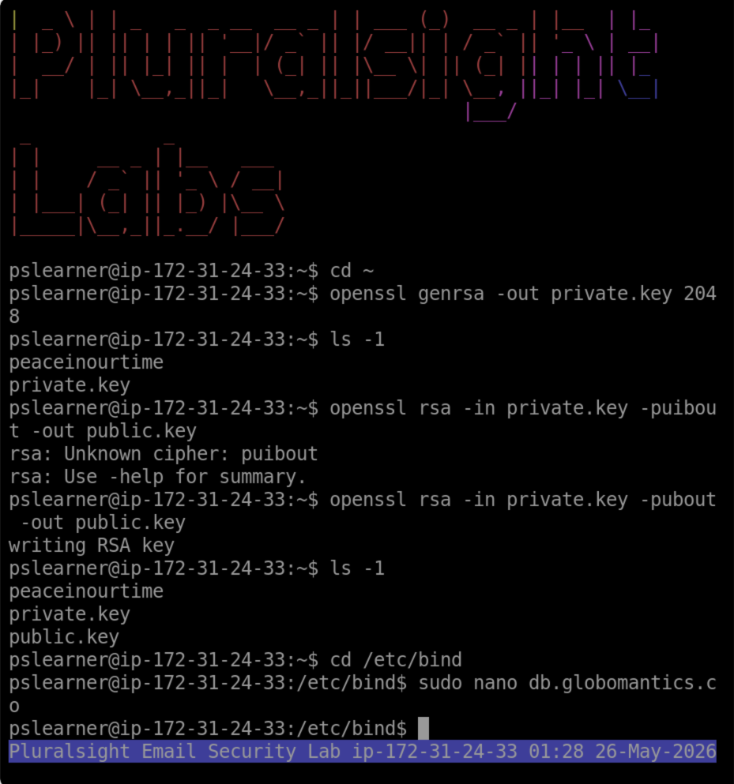
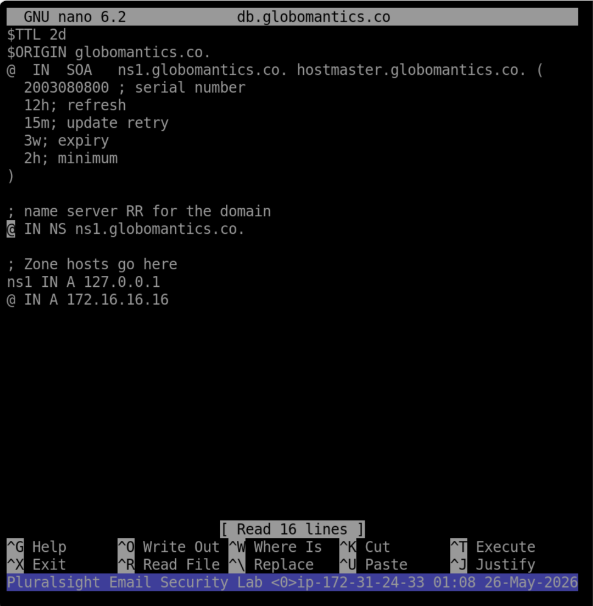

# Email Security Lab: SPF, DKIM, and DMARC Configuration

## Overview
This project demonstrates how SPF, DKIM, and DMARC records are configured and verified using Linux, BIND9 DNS, OpenSSL, and the `dig` command.

The goal of this lab was to understand how email authentication helps reduce spoofing, phishing, and unauthorized email activity.

---

## Technologies Used
- Ubuntu Linux
- BIND9 DNS Server
- OpenSSL
- Nano
- DNS TXT Records
- SPF
- DKIM
- DMARC
- dig

---

## Objectives
- Configure an SPF DNS TXT record
- Generate DKIM public and private keys
- Publish a DKIM public key in DNS
- Configure a DMARC policy
- Restart the DNS service
- Verify all records using `dig`

---

# SPF Configuration

SPF was configured to define which mail servers are allowed to send email for the domain.

SPF Record:
```txt
v=spf1 mx include:spf.protection.outlook.com ~all
```

SPF Verification:
```bash
dig @[server-ip] globomantics.co txt
```


---

# DKIM Configuration

DKIM was configured by generating an RSA key pair and publishing the public key as a DNS TXT record.

Key Generation:
```bash
openssl genrsa -out private.key 2048
openssl rsa -in private.key -pubout -out public.key
```



The DKIM public key was added to the DNS zone file.



The DNS service was restarted to apply the changes.

```bash
sudo service bind9 restart
```


DKIM Verification:
```bash
dig @[server-ip] mail._domainkey.globomantics.co txt
```


---

# DMARC Configuration

DMARC was configured to define how receiving mail servers should handle messages that fail authentication checks.

DMARC Record:
```txt
v=DMARC1; p=none; rua=mailto:dmarc@globomantics.co
```

DMARC Verification:
```bash
dig @[server-ip] _dmarc.globomantics.co txt
```


---

# Skills Demonstrated
- Linux command-line usage
- DNS zone file editing
- BIND9 DNS administration
- Email authentication configuration
- OpenSSL key generation
- DNS troubleshooting
- SPF, DKIM, and DMARC verification

---

# Key Takeaways
This lab helped me understand how organizations use SPF, DKIM, and DMARC to protect domains from spoofing and phishing attacks.

I also gained hands-on experience editing DNS zone files, restarting DNS services, generating cryptographic keys, and verifying DNS TXT records using command-line tools.
