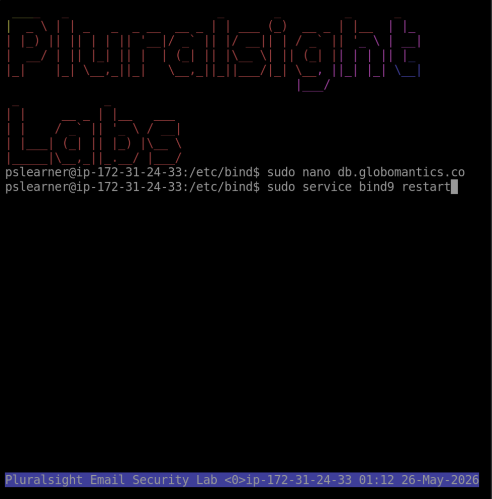
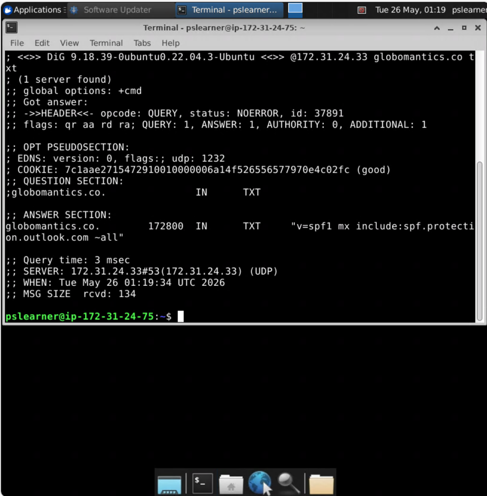
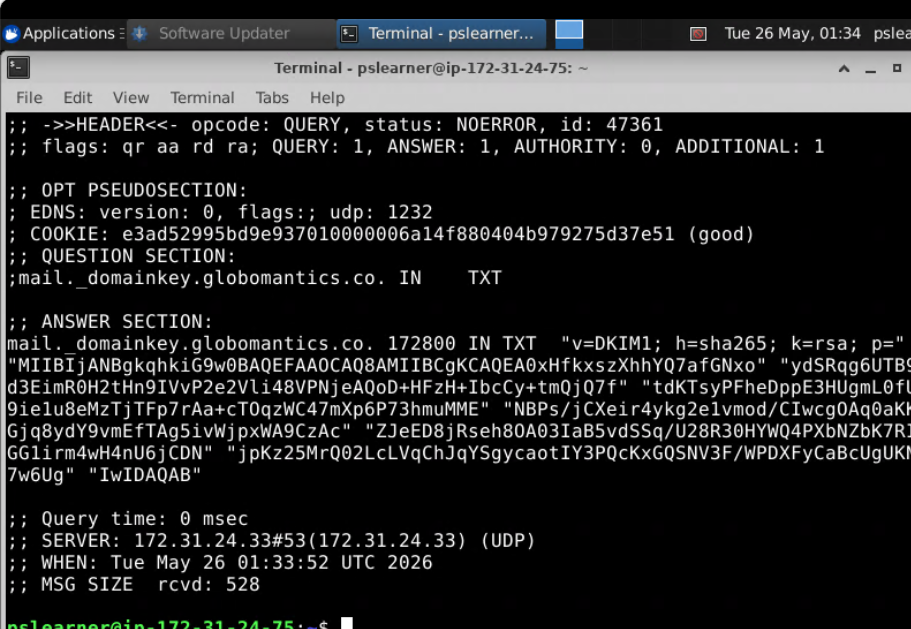
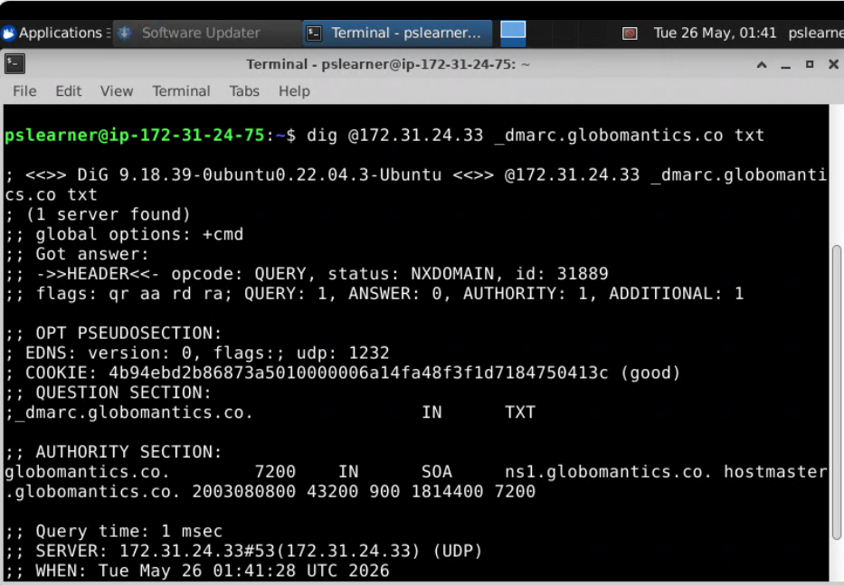

Email Security Lab: SPF, DKIM, and DMARC Configuration
Overview

This project demonstrates the implementation of enterprise email authentication technologies using Linux, BIND9 DNS, OpenSSL, and command-line networking tools.

The lab focused on configuring and verifying:

SPF (Sender Policy Framework)
DKIM (DomainKeys Identified Mail)
DMARC (Domain-based Message Authentication, Reporting, and Conformance)

The configurations were performed on a Linux DNS server and verified using the dig DNS lookup utility.

Technologies Used
Ubuntu Linux
BIND9 DNS Server
OpenSSL
Nano Text Editor
DNS TXT Records
SPF
DKIM
DMARC
dig
Objectives
Configure SPF records to authorize mail senders
Generate RSA keys for DKIM signing
Publish DKIM public keys in DNS
Configure DMARC email policies
Restart DNS services
Verify DNS records using command-line tools
SPF Configuration
Added SPF TXT Record
v=spf1 mx include:spf.protection.outlook.com ~all
SPF Verification
dig @[server-ip] globomantics.co txt

DKIM Configuration
Generated RSA Key Pair
openssl genrsa -out private.key 2048
openssl rsa -in private.key -pubout -out public.key

DNS Zone File Configuration

The DKIM public key was added as a DNS TXT record under:

mail._domainkey.globomantics.co

Restarted DNS Service
sudo service bind9 restart

DKIM Verification

The DKIM record was verified successfully using:

dig @[server-ip] mail._domainkey.globomantics.co txt

DMARC Configuration
Added DMARC TXT Record
v=DMARC1; p=none; rua=mailto:dmarc@globomantics.co
DMARC Verification
dig @[server-ip] _dmarc.globomantics.co txt

Skills Demonstrated
Linux system administration
DNS server configuration
Email security implementation
Cryptographic key generation
DNS troubleshooting
Command-line networking tools
SPF/DKIM/DMARC configuration
BIND9 administration
Key Takeaways

This project provided hands-on experience implementing modern email authentication standards used in enterprise environments to reduce spoofing, phishing, and unauthorized email usage.

The lab also reinforced practical Linux administration, DNS management, and troubleshooting skills commonly used in cybersecurity and cloud engineering environments.
